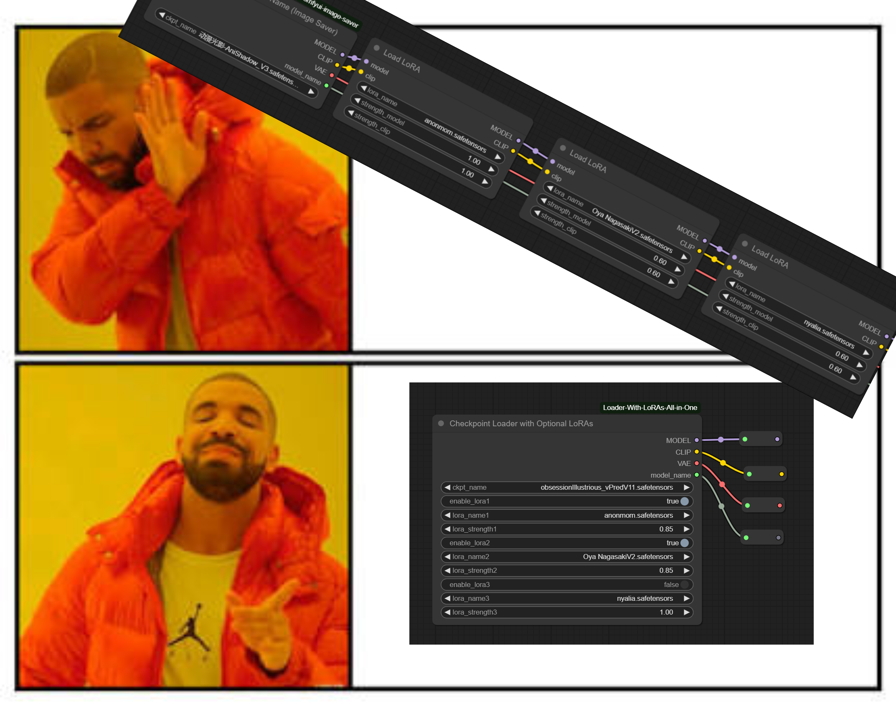
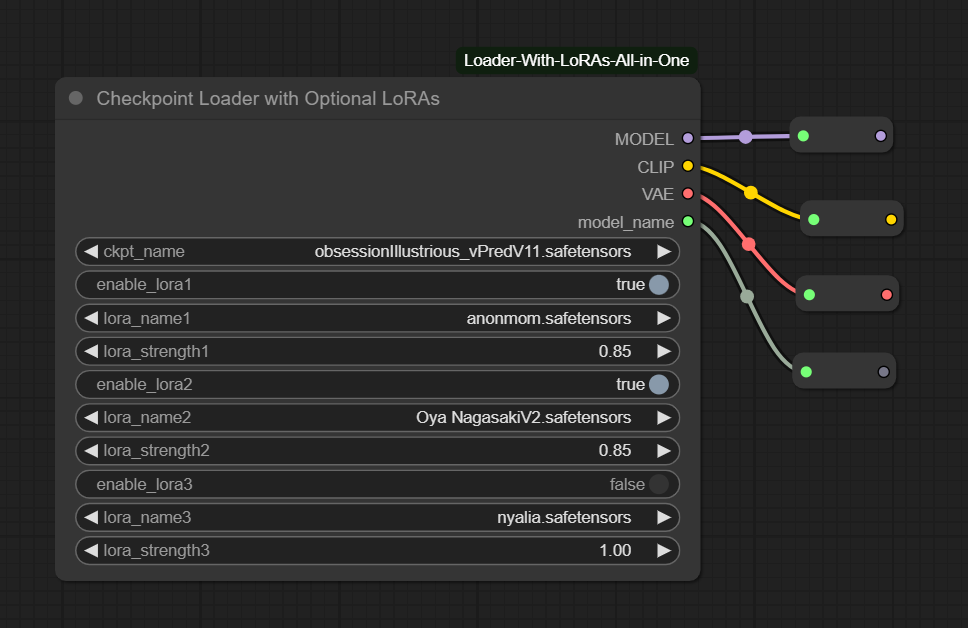

# ComfyUI Loader With LoRAs All in One

Tired of complex node connections? Fed up with long, unwieldy LoRA linking processes? Frustrated when changing a single LoRA means reconnecting a bunch of nodes? Worry no more - "Checkpoint Loader With LoRAs" is here to save the day! This all-in-one solution is like fitting your ComfyUI workflow with a "three-in-one" supercharged engine - one node to rule them all! Why use three nodes when one can do the job perfectly? Simplify your workflow, unleash your creativity, and bring AI art creation back to being simple and efficient.

还在为复杂的节点连线而头疼吗？厌倦了那些长长的、难以管理的LoRA链接流程？每次想更换一个LoRA就要重新连接一堆节点？不用担心，"Checkpoint Loader With LoRAs"来拯救你了！一个节点搞定所有事情！为什么要用四个节点做的事情，当一个节点就能完美解决呢？简化你的工作流程，释放你的创造力，让AI艺术创作回归简单与高效。

  <h3>✨ Proudly presenting this plugin: <strong>ComfyUI Loader With LoRAs All in One</strong> ✨</h3>
  <h3>✨ 如果你是懒人，快来试试: <strong>融合一体的LoRA加载器</strong> ✨</h3>

## Introduction 简介
This plugin provides a custom node for ComfyUI that combines checkpoint loading with optional LoRA application. It allows you to load a model checkpoint and apply up to three LoRAs with adjustable strengths in a single node, simplifying your workflow.

该插件为 ComfyUI 提供了一个自定义节点，将检查点加载与可选 LoRA 应用相结合。它允许你在一个节点中加载模型检查点并应用最多三个 LoRA，每个 LoRA 都有可调节的强度，从而简化你的工作流程。

## Features 功能
- Load checkpoint models (MODEL, CLIP, VAE) just like the standard checkpoint loader
- Apply up to three LoRAs with individual enable/disable toggles
- Adjust LoRA strength for each LoRA (same value applies to both model and CLIP)
- Memory-efficient LoRA caching to avoid reloading the same LoRAs

- 像标准检查点加载器一样加载检查点模型（MODEL, CLIP, VAE）
- 应用最多三个 LoRA，每个都有单独的启用/禁用开关
- 调整每个 LoRA 的强度（相同的值同时应用于模型和 CLIP）
- 内存高效的 LoRA 缓存，避免重复加载相同的 LoRA

## Installation 安装

### Install by ComfyUI Manager (Recommended) 通过 ComfyUI 管理器安装（推荐）
1. Open ComfyUI
2. Go to Manager tab
3. Search for "Checkpoint Loader With LoRAs"
4. Click Install

1. 打开 ComfyUI
2. 转到管理器选项卡
3. 搜索 "Checkpoint Loader With LoRAs"
4. 点击安装

### Manual Installation 手动安装
1. Go to ComfyUI custom_nodes folder, `ComfyUI/custom_nodes/` 
2. Clone this repository: `git clone https://github.com/yourusername/ComfyUI-Checkpoint-Loader-With-LoRAs.git`
3. Restart ComfyUI

1. 打开 ComfyUI 插件目录 `ComfyUI/custom_nodes/`
2. 克隆此仓库：`git clone https://github.com/yourusername/ComfyUI-Checkpoint-Loader-With-LoRAs.git`
3. 重启 ComfyUI

## Usage 使用方法

### Checkpoint Loader with Optional LoRAs 带可选 LoRA 的检查点加载器

#### Required Inputs 必需输入
- **ckpt_name**: Select the checkpoint model to load
  选择要加载的检查点模型

#### Optional Inputs 可选输入
- **enable_lora1**: Toggle to enable/disable the first LoRA
  启用/禁用第一个 LoRA 的开关
- **lora_name1**: Select the first LoRA to apply (only active when enabled)
  选择要应用的第一个 LoRA（仅在启用时激活）
- **lora_strength1**: Adjust the strength of the first LoRA (affects both model and CLIP)
  调整第一个 LoRA 的强度（同时影响模型和 CLIP）

- **enable_lora2**: Toggle to enable/disable the second LoRA
  启用/禁用第二个 LoRA 的开关
- **lora_name2**: Select the second LoRA to apply (only active when enabled)
  选择要应用的第二个 LoRA（仅在启用时激活）
- **lora_strength2**: Adjust the strength of the second LoRA (affects both model and CLIP)
  调整第二个 LoRA 的强度（同时影响模型和 CLIP）

- **enable_lora3**: Toggle to enable/disable the third LoRA
  启用/禁用第三个 LoRA 的开关
- **lora_name3**: Select the third LoRA to apply (only active when enabled)
  选择要应用的第三个 LoRA（仅在启用时激活）
- **lora_strength3**: Adjust the strength of the third LoRA (affects both model and CLIP)
  调整第三个 LoRA 的强度（同时影响模型和 CLIP）

#### Outputs 输出
- **MODEL**: The loaded U-Net model with LoRAs applied
  加载的 U-Net 模型（已应用 LoRA）
- **CLIP**: The loaded CLIP model with LoRAs applied
  加载的 CLIP 模型（已应用 LoRA）
- **VAE**: The loaded VAE model
  加载的 VAE 模型
- **model_name**: The name of the loaded checkpoint
  加载的检查点名称

## Comparison to Other Methods 与其他方法的比较

### Advantages 优势:
- Single node solution - no need for separate checkpoint loader and multiple LoRA loader nodes
- Simplified workflow with fewer connections
- Memory efficient with LoRA caching
- Clear UI with enable/disable toggles for each LoRA

- 单节点解决方案 - 无需单独的检查点加载器和多个 LoRA 加载器节点
- 简化的工作流程，减少连接
- 具有 LoRA 缓存的内存效率
- 清晰的 UI，每个 LoRA 都有启用/禁用开关

### Limitations 局限性:
- Currently limited to three LoRAs
- Uses the same strength value for both model and CLIP

- 目前限制为三个 LoRA
- 对模型和 CLIP 使用相同的强度值

## Submit an issue if you have a good suggestion 如果你有好的建议，可提交 issue
If you have suggestions or encounter any problems, please submit an issue on GitHub.

如果你有建议或遇到任何问题，请在 GitHub 上提交 issue。